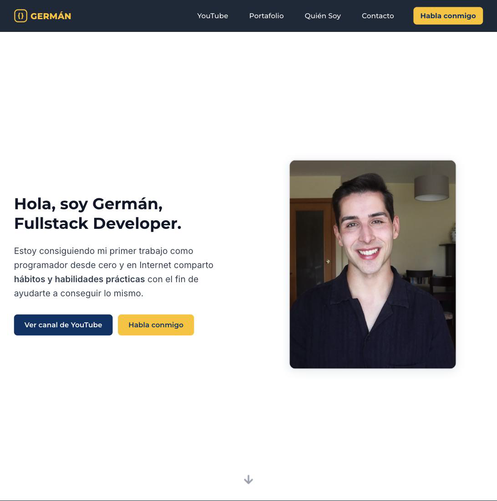

# Germán Hernández — Personal Brand Website

A personal brand site built around one message: **a Fullstack Developer landing his first job in tech from scratch, sharing the practical habits and skills to help you land yours.** It covers who I am, the projects I've shipped, the YouTube channel where I document the journey, and how to get in touch — all in one fast, animated, mobile-first experience.


**Live → [germanhernandezmairal.com](https://www.germanhernandezmairal.com)**



---

## Positioning

The whole site speaks to one audience — students and recent grads trying to break into tech — with one value proposition:

> **Fullstack Developer** getting my first job as a programmer from zero. I share **practical habits and skills** so you can get yours.

That's backed by a real second angle: hands-on experience in **communication and community management** for institutions and brands. Every page, CTA, and meta tag is written to that positioning; the call to action throughout is *"Habla conmigo"* → the contact form.

---

## Stack

| Layer | Choice | Why |
|---|---|---|
| Framework | React 18 + React Router v7 | SPA with clean client-side routing and animated page transitions |
| Build | Vite 5 | Instant HMR in dev, fast optimized builds |
| Styling | Tailwind CSS v4 | Utility-first with custom design tokens for the brand palette |
| Animation | Framer Motion 12 | Scroll-triggered reveals, staggered lists, and page-exit transitions |
| SEO | react-helmet-async v2 | Per-page `<title>` and meta descriptions without a full SSR setup |
| Data | YouTube Data API v3 | Dynamic video grid that pulls playlist content at runtime |
| Payments | Stripe Payment Links | Direct checkout for the (unlisted) service packages — no backend needed |
| Forms | reCAPTCHA v3 + custom backend | Spam-protected contact form with email delivery |
| Deployment | Vercel | Zero-config deploys, preview URLs on every push |

---

## Pages

- **Home** (`/`) — Hero with the value proposition, two "how I can help" cards (Hábitos · Habilidades → YouTube), and a contact CTA
- **YouTube** (`/youtube`) — Channel positioning ("Aprende a Conseguir tu Primer Trabajo"), the two content pillars, audience testimonials, and a live video grid from the API
- **Portfolio** (`/portfolio`, titled *Proyectos Reales*) — Filterable project grid: **Educación · Salud · Otros**, five real projects with live + GitHub links
- **About** (`/about`, *Quién Soy*) — Story (La Base Técnica · Comunicación y Comunidad · Camino hacia el primer trabajo), skills (Frontend · Backend & Deploy), and mission
- **Contact** (`/contact`) — reCAPTCHA-protected form, 24h response promise
- **Services** (`/services`) — Content + web-development packages with Stripe checkout. **Unlisted**: `noindex`, off the sitemap, reachable by direct URL only
- **Case study** (`/portfolio/tarragona-jove`) — Tarragona Jove institutional brand management deep dive. Also unlisted

Header/footer nav: **YouTube · Portafolio · Quién Soy · Contacto**.

---

## What I focused on

**Animations that don't get in the way.** Every page transition, card reveal, and list stagger uses Framer Motion presets from `src/lib/motion.js` — tuned to feel snappy rather than decorative.

**A real design system.** Navy `#003366` + amber `#FFC107`, two custom font families (Montserrat / Inter), and a small set of Tailwind utilities that keep every page visually consistent without a component library.

**Copy that all points one way.** Every headline, sub-head, and CTA is written to the "first job in tech" positioning — no generic freelancer language. Metadata (`index.html`, every page `<Helmet>`, `sitemap.xml`, `robots.txt`) matches.

**Integrated services.** YouTube API, Stripe, Calendly, and reCAPTCHA all wired together — the site functions as a lightweight business tool, not just a static brochure.

**Mobile-first throughout.** Custom breakpoints down to 320px, a slide-in hamburger menu, and touch-friendly tap targets everywhere.

---

## Local setup

```bash
git clone https://github.com/germanhernandezmairal/germanhernandezmairal.com.git
cd germanhernandezmairal.com
npm install
```

Create a `.env.local` file (see `.env.example`):

```env
VITE_YOUTUBE_API_KEY=your_youtube_data_api_v3_key
```

```bash
npm run dev      # Dev server with HMR → http://localhost:5173
npm run build    # Production build → /dist
npm run preview  # Preview the production build locally
npm run lint     # ESLint
```

---

## Contact

Are you a programmer trying to land your first job in tech?

- **Web** → [germanhernandezmairal.com/contact](https://www.germanhernandezmairal.com/contact)
- **YouTube** → [@germanhernandezmairal](https://youtube.com/@germanhernandezmairal)
- **LinkedIn** → [linkedin.com/in/germán-hernández-mairal](https://www.linkedin.com/in/germán-hernández-mairal-7584741ab/)
- **Email** → gerhm19@gmail.com
